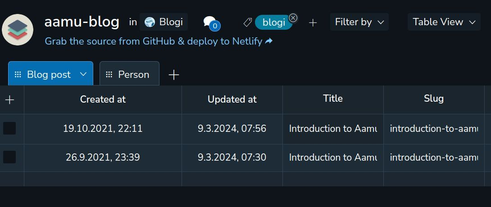
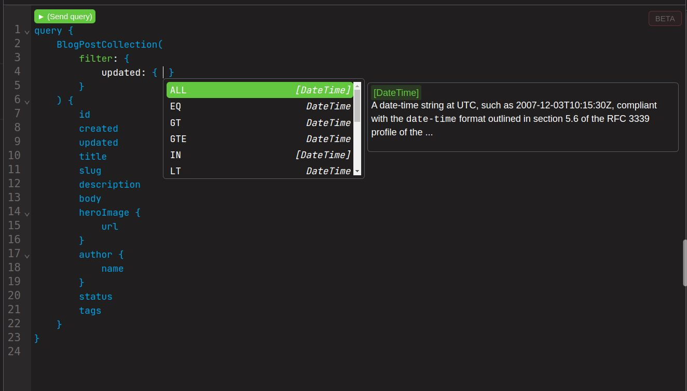

---
author: "Ilkka Huotari"
title: "Introduction to Aamu.app GraphQL"
date: "2021-10-19T09:00:00.000Z"
modified: "2024-03-11T05:15:17.865Z"
description: "How to use the database from a distance"
cover:
  image: 1634671479716.jpg
tags: ["graphql"]
ShowToc: false
ShowBreadCrumbs: false
---

Aamu.app database supports two APIs: one for submitting data into the database via standard html forms – this works just one direction. Also you can get and put data into the database via GraphQL.

As Wikipedia [says it](https://en.wikipedia.org/wiki/GraphQL):

> GraphQL is an open-source data query and manipulation language.

It has a syntax for reading and writing the database. For testing it out, it is helpful to have a tool. I like [Altair](https://altair-gql.sirmuel.design/).

To use Altair or any similar tool you first need to setup it with the database endpoint and the database API key. The database endpoint is:

```plain
https://api.aamu.app/api/v1/graphql/
```

You can get the API key from your _database settings._

Querying the database
---------------------

Let's assume we are using the database **aamu-blog**, which is the actual database which holds the blog posts you are reading now! The database looks like this in Aamu.app:



It has two tables: "Blog post" and "Person". Our GraphQL API will have these fields for this database:


So, the GraphQL API will create two fields for each table, one for fetching a single item (by an **ID**), e.g. **BlogPost** and one for fetching many items (by some criteria you define).

Let's see how to get a single item. This is the query:

```plain
query {
  BlogPost (slug: "introduction-to-aamuapp-graphql") {
    id
    created
    updated
    title
    slug
    description
    body
    status
  } 
}
```

When you do the query, you will get the data back (if it exists) as json:

```plain
{
  "data": {
    "BlogPost": {
      "id": "3cfa30f8-ab29-459a-ad91-0651ae0b08ad",
      "created": "2021-10-19T19:11:49.257Z",
      "updated": "2024-03-09T07:38:23.916Z",
      "title": "Introduction to Aamu.app GraphQL",
      "slug": "introduction-to-aamuapp-graphql",
      "description": "How to use the database from a distance",
      "body": "Aamu.app database supports two APIs: one for submitting data into the database via standard html forms – this works just one direction. Also you can get and put data into the database via GraphQL.
      ... etc
```

You can also get items by querying the field **BlogPostCollection**. This gives you multiple rows. You can also do filtering, sorting and pagination.

Let's see how getting multiple posts goes. Let's get all the blog posts that are published (status is "published") and the results will be sorted by creation date (older first):

```plain
query {
    BlogPostCollection(
        filter: { status: { EQ: "published" } }
        sort: { created: DESC }
    ) {
        title
        slug
        created
        description
    }
}
```

This will give the following results:

```plain
{
  "data": {
    "BlogPostCollection": [
      {
        "title": "Introduction to Aamu.app GraphQL",
        "slug": "introduction-to-aamuapp-graphql",
        "created": "2021-10-19T09:00:00.000Z",
        "description": "How to use the database from a distance"
      },
      {
        "title": "Introduction to Aamu.app",
        "slug": "introduction-to-aamu-app",
        "created": "2021-10-10T09:00:00.000Z",
        "description": "Aamu.app is an all-in-one productivity tool"
      }
    ]
  }
}
```

You can use other filtering methods, for example GT (Greater Than):

```plain
query {
    BlogPostCollection(
        filter: {
            updated: { GT: "${new Date(latestUpdatedPost).toISOString()}" }
        }
    ) {
		id
		created
		updated
		title
		slug
		description
		body
		heroImage {
			url
		}
		author {
			name
		}
		status
		tags
    }
}
```

This is the actual query which I'm using to create this blog you are reading. This will fetch all the updated blog posts since I ran this last time (since I built the blog last time). I'm using Hugo to create this blog, and the blog posts are in Aamu's database and I'm writing this using the Aamu's Documents feature.

Note that there is a field called **heroImage**, which has a subfield **url**. You can find all the fields with [Altair](https://altairgraphql.dev/)'s Docs feature. It will fetch the database structure and you will see all the fields that you can query (or mutate).

With Altair you can also see what kind of filtering you can do. For example, Altair sees that the **updated** field is a date and will give you the following filtering options:



You can get that list by pressing Ctrl-Space.

You can also get similar lists in every spot in the query window – all the fields and filtering options will be easy to see.

In the next post we will get to know the mutation with GraphQL.
